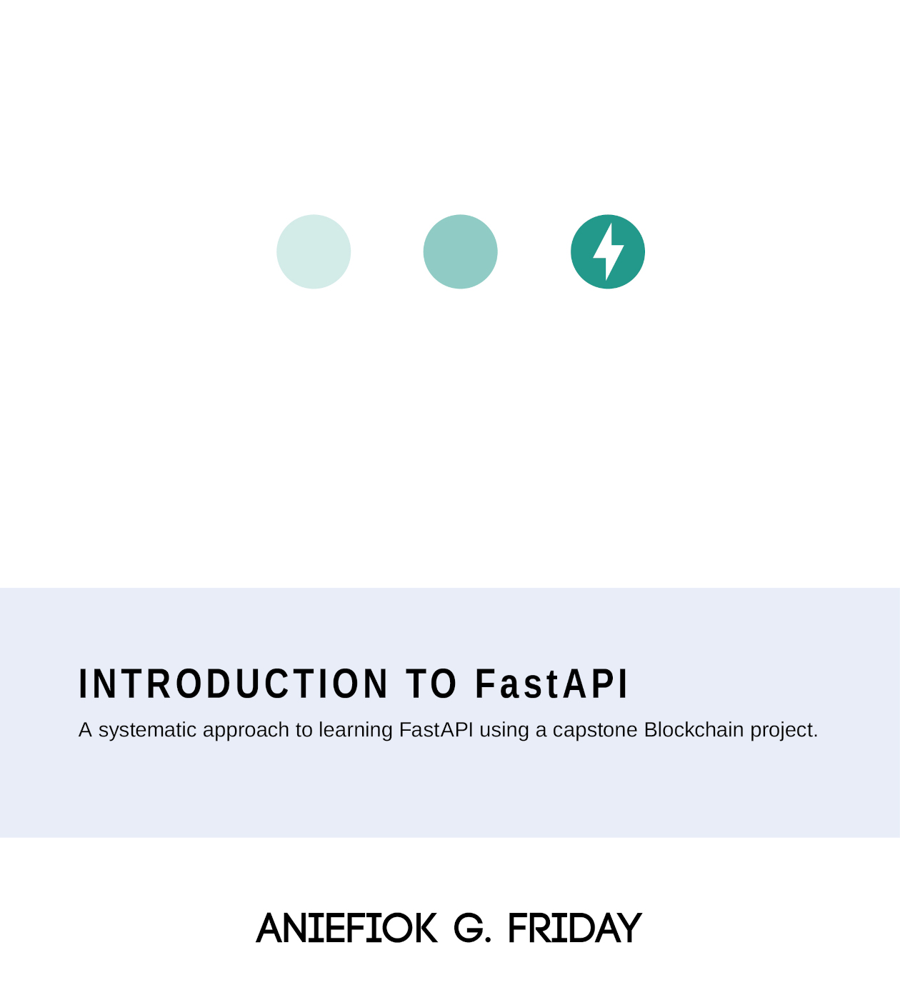

# 100 Pages to Fast API

*A systematic approach to learning FastAPI using capstone Blockchain project.*

This book was written using lessons learned from developing products for Bitmast Digital Services Ltd, tutorials for the
Codeskol and Boot camp training, and applications for A17S clients. The audience for this book is developers with some
level of knowledge of Python programming who may have a background in web application development using frameworks like
Django or Flask.

Freely available for download from support by  Digital Services LTD.
