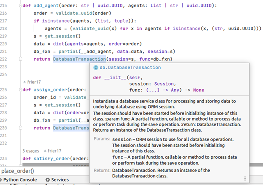

+++
title = 'Introduction to FastAPI'
date = 2023-11-05T21:38:27+01:00
weight = 3
draft = true
+++

*FastAPI is a modern, fast (high-performance), web framework for building APIs with Python 3.7+ based on standard Python type hints.*

## Modern Python with AsyncIO 
Python as a programming language has evolved over time with support for features like multiprocessing, asynchronous task, generators, concurrency, and type hinting. One of the beautiful things about Python language is its simplicity. Overtime, the core language developers and maintainers have shown that simple doesn’t imply powerless. Python indeed is a powerful programming language with a rich ecosystem that cater for scientific calculations, data analysis, machine learning and web application development. The addition of the multiprocessing, concurrency, and asyncio packages to Python brings the benefit of executing multiple tasks simultaneously. The asyncio package enable developers to write faster code using Coroutine, Task, and Future objects. These objects can typically execute a code on an event loop. Results from running such codes can be received by waiting for execution of the on the event loop in a non-blocking manner. Details of the asyncio package is beyond the scope of this book but to better appreciate the FastAPI framework and the mWallet project we will look into Generator (this is not part of the asyncio package), Coroutine, Task, and Thread.

Generator function in Python is an object which can be iterated and can "remember" their iterated value. An iterator generator is the result of a generator function. The yield expression in the generator function allows it to produce a succession of values that are retrieved one at a time. Generators are effective for iterating values as each yield halts processing momentarily while keeping track of the execution state of the location (including variables and pending statements) unlike functions which begin from scratch with each call. Internally, a generator has the special `__next__` method that defines how it can be iterated and retain its last state. Calling `next()` function on a generator will move it forward by a step. If all values of the generator has been retrieved and next() is called, the generator will raise a `StopIteration` exception indicating the end of the sequence.

~~~python

class A:
    names = ['Flash', 'Superman', 'Batman', 'Wonder Woman']
    
    def __next__(self):
        for x in self.names:
            print(f'Name super hero/heroine: {x}')
            yield x
 
def named_heroes():
    names = ['Flash', 'Superman', 'Batman', 'Wonder Woman']
    for x in names:
        yield x
        print(f'Printing the name of heroes after yield. Next execution will print: {x}')

~~~

Creating an instance of class A and calling the `next()` on that instance will move the iterator of names by a step. Each call to next will print 'Flash', 'Superman', 'Batman' ... in the order in which they ware defined in the list, names. The alternate approach of defining a generator uses a function that yields a name.
Note the print function is called after the yield. This implies that the next name in the list will be printed after the first call to `next()`. Hence, the name 'Flash' will not be printed.

> "Coroutines are computer program components that allow execution to be suspended and resumed, generalizing subroutines for cooperative multitasking." – Wikipedia.

In Python coroutines are defined using the `async` keywords. Coroutines are only executed or run by calling the `asyncio.run` function. Calling the coroutine directly will not execute the function but return a type coroutine. To execute a coroutine, one will either await the coroutine or execute it via `asyncio.run` function. 

~~~python

async def run_later(t: int = 5):
     
     await asyncio.sleep(t)
     print(f‘Executing after sleeping for {t} seconds’)
 
asyncio.run(run_later(10))

~~~

The code above will sleep or wait for `t` number of seconds. In our example, the code will sleep for ten seconds. If the time, `t`, is not specified then the code will print a message after five seconds. The function `run_later` is a coroutine and is defined like any other function in Python but its definition must have an async keyword preceding it.

Tasks are a major component of the `asyncio` package. A task is a wrapper function for coroutine. Tasks can be used to schedule and manage the sequence in which coroutines are added to the event loop for execution. Typically, a task is generated by calling the `asyncio.create_task` function with the desired coroutine. Tasks can also be executed by calling the `asyncio.run` function. 

~~~python

async def run_later(t: int = 5):
     
     await asyncio.sleep(t)
     print(f‘Executing after sleeping for {t} seconds’)
 
async def main():
     task_a = asyncio.create_task(run_later())
     task_b = asyncio.create_task(run_later(20))
 
     await task_a
     await task_b
 
asyncio.run(main())

~~~

The tasks (`task_a`, `task_b`) are both created and associated with the `run_later` coroutine. Task `task_a` will wait for 5 seconds while `task_b` will wait for 20 seconds. Notice we defined a new coroutine main which is then executed by the `asyncio.run` function. When main executes, tasks will be run and managed internally by the `asyncio` package. The developer does not need to worry about firing any thread. We only need to wait for the task to execute and terminate. To do this, we use the await keyword to schedule and wait for the task. Failing to call await on a task will leave us without any result.

Future in `asyncio` serves as placeholders for results of executing an asynchronous operation. As an example, a task may return a value after completion and this value is not directly available save by a future object. Future objects can be used to implement callback mechanisms for coroutine.

Thread class in Python represents a mechanism by which a function can be executed on a separate CPU thread. Thread in Python can be managed at a high level by using a thread pool. The `concurrent.future.ThreadPoolExecutor` offers a high level interface to execute functions on background threads. 

`Coroutine`, `Future` and `Task` objects are implementations of the `Awaitable` abstract base class with `Task` extending the Future class as shown below. 

 [^2]

[^2]: Image attribution: [The Python Tutorial](https://www.pythontutorial.net/)

It is important to note that certain processes in computing cannot be run asynchronously. The benefit of `asyncio`, hence, is not available in every scenario. However, for web-based systems, there are multiple cases in which having a non-blocking process or thread can be a valuable means of saving time. Also, Python Global Interpreter Lock (`GIL`) ensures multiple Python bytecodes are not ran on various threads by the Python interpreter (for Python versions below 3.12). This means `asyncio` will not make much savings on a CPU bound task without proper use of multiprocessing. For jobs that are IO intensive, it may be preferable to use Threads as this will not be limited by the `GIL`. For the mWallet application, database connections are made on separate threads and the connection object passed as a generator object across the application. Results from executing database queries are also not automatically consumed but returned as a Python `Generator` object. This allows for iterating through results only when they are available at minimal cost of data and a high gain on speed. 

#### 📚 Further Read – Generators, Futures & Python Concurrency

> __Short reads on Coroutine__
> 📖 [What is a coroutine](https://www.educative.io/answers/what-is-a-coroutine)
> 📖 [Extract from official Python documentation on coroutine](https://docs.python.org/3/glossary.html#term-coroutine)
> 📺 [Example video on coroutine from YouTube](https://www.youtube.com/watch?v=Bv25Dwe84g0)
> 📖 [Coroutine on Wikipedia](https://en.wikipedia.org/wiki/Coroutine)
> __Quick reads on Python Generators__
> 📖 [Python Wiki - Generators](https://wiki.python.org/moin/Generators)
> 📖 [Extract from official Python documentation on Generators](https://docs.python.org/3/howto/functional.html#generators)
> 📖 [Python Tips - Generators](https://book.pythontips.com/en/latest/generators.html)
> __Detail read on Futures & Concurrency__
> 📖 [Python official documentation on asyncio task](https://docs.python.org/3/library/asyncio-task.html?highlight=concurrency)
> 📖 [Python official documentation on concurrent.futures package](https://docs.python.org/3/library/concurrent.futures.html#module-concurrent.futures)

## JSON and API data
Web API provides application developers, third party systems, or other users a means by which they can access specialized web resources, computer programs or functions. Web API comprises the set of HTTP requests and their responses. Modern web API uses a subset of HTTP concepts with other computer concepts like endpoint with parameters common in Remote Procedure Call (RPC) systems. Since data is often shared via web API, it is important to define the semantic and type of data between the web API server and other system users. A common messaging construct for sharing data is Extensible Markup Language (XML) and JavaScript Object Notation (JSON). Due to the simplicity of JSON, ubiquitous nature of JavaScript and its wide usage in the web, the JSON data format is the de facto means of sharing data for web APIs. The JSON standard requires only key-value pairs and supports a small range of data types like string, Boolean, Null, and Number. It is advisable to keep JSON of web API simple with each key being intuitive or appropriate names for your model attributes.

#### ℹ️ Tips and Tricks – towards a better data representation
> In FastAPI, the Pydantic model class is used to provide the service of matching a data model to JSON response output. Pydantic models can also be returned as Python dictionary type or initialized from dictionary types with matching keys to that of the model fields. This makes for easy parsing from one data structure to another (dictionary to model vis-à-vis). For the mWallet project, API endpoints by default accepts a dictionary or Pydantic model. Responses to HTTP requests are returned as JSON by default while return values of endpoints are database ORM instances that can be dynamically parsed to Pydantic models or a dictionary. References to linked objects can be captured using an id field or as nested model. However, in the JSON representation, these references could be represented as URLs that points to the referenced object. This is more in line with HTTP standard for RESTful web APIs.

## Why FastAPI?
My first impression when I looked at FastAPI was: "this is simple"! However, like many other Python programmers then, I had to make the choice of working with FastAPI and Django. At the time, I already had toolkits for generating from my Django models associated forms.py, views.py, and urls.py scripts. Django has a rich ecosystem and is a well-structured framework. However, FastAPI introduced type hints, async web servers, and data validation to the web development space. This was a major consideration for me. Aside from automatic validation of data, there was also the [Swagger documentation](https://swagger.io/docs/) that comes ready with the FastAPI framework. Added to this was the fact that FastAPI had a higher performance in terms of server response due to its use of an asynchronous framework under the hood. So, a typical web application (app) on FastAPI comes ready with web documentation, support for asynchronous server, data validation, to name a few. Some impressive features are:

1. Routing system. The routing system is based on Starlette as FastAPI is built on the Starlette framework. For people coming from a background using Flask, they will find the routing very similar or equivalent to that of Flask. There however is the power of data type hints used in FastAPI routing and the benefit of using dependency to automatically inject code into route functions. More details on this will be seen in the routing section of the book.
2.	Flexible framework structure. There is no defined or adopted file structure for FastAPI. However, for this book, we propose a file structure we believe will help separate various system behaviours into packages. This is not compulsory as the FastAPI system on modern Python can simply resolve imported class paths as needed.
3.	Pydantic Feature. The [Pydantic](https://docs.pydantic.dev/latest/) model allows for a simple yet powerful data validation system for Python. Pydantic enforces type hints at runtime and provides user friendly errors when data is invalid. FastAPI incorporates Pydantic in parsing web requests into data schemas. Schemas have an inbuilt validation method for ensuring posted data matching native Python data types. Furthermore, developers can add custom validation logic to match their business use case.
4.	Starlette Features. FastAPI is built on Starlette hence any Starlette code works seamlessly with FastAPI. Also, some classes (example APIRoute and APIRouter) of FastAPI are simply wrapper classes of the underlying Starlette counterpart. In such cases, developers may use either classes defined in FastAPI or those defined in Starlette. In this book, some code snippets may have imported classes from Starlette. 
5.	Third party integration. Python packages and plugins can be easily imported into web applications running on FastAPI. Simply install desired packages using the pip or similar package installer and import needed classes into your web application. The [blockcypher python SDK](https://github.com/blockcypher/blockcypher-python), [Amazon Web Services (AWS) SES](https://aws.amazon.com/ses/), and a Python [PayStack](https://paystack.com/docs/api/) wrapper was used extensively in the project covered in this book. 
6.	Authentication and Permission. FastAPI comes with security and authentication that complies with standards such as OAuth2. All security features supported by OpenAPI are supported by FastAPI. Security can also be modified or integrated with data models, relational databases etc.
7.	Editor Support. With type hinting, modern editors can provide suggestions and autocompletion for coding while using FastAPI. Multiple IDEs provide these features when using FastAPI making it easy to use the framework. Furthermore, class, methods, and function names are intuitive, and the framework code base is well documented. 

[^1]

[^1]: IDE support for FastAPI with hints.

FastAPI in my opinion did effectively capture modern web development trends and gives developers access to a rich collection of features in Starlette, Pydantic and the Python programming language. 

At the end of the day, every framework simply boils down to codes of a programming language. One of the major benefits of a framework is that it simplifies development by providing out of the box features which are generally repeated in web projects. Each framework has a development culture, and it is the development culture that drives the design and use of all frameworks whether it is CakePHP, ZendFramework, CodeIgniter, Ruby on Rails, or django. Each framework, with its set of philosophies,  aims to solve common problems thereby enabling developers to focus on the business need.

FastAPI is not any different in the regard of development culture. Loads of common features are also provided with little configuration enabling developers to quickly mock up a prototype for projects. 
