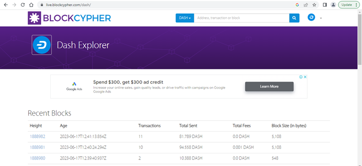
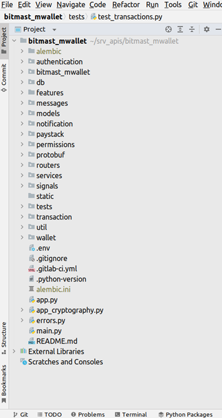

+++
title = 'The mWallet Project'
date = 2023-11-05T21:44:39+01:00
weight = 4
draft = true
+++

Bitmast Digital Services developed the mWallet project as a peer-to-peer bitcoin trading platform. The app is a micro cryptocurrency service that allows users to execute transactions in a variety of currencies quickly and easily utilising a streamlined set of functionalities. The system's primary functions are as follows:

1.	Generate cryptocurrency addresses for registered users for each transaction.
2.	Enable users purchase an asset via real time or offline orders using a peer-to-peer system. 
3.	Enable enjoy secure asset transfer through an escrow bank account and cryptocurrency wallet to prevent possible fraud. 

That’s all!

Bitmast mWallet was designed to address the problem of Peer-to-Peer transactions in Nigeria. The current P2P landscape exposes users to a variety of issues - including privacy concerns. Furthermore, a poor or limited connection to the internet can impact transactions and cause delays. mWallet aims to address these problems by using a P2P approach that supports both real time and offline transactions. But before we delve further into the system, lets understand some concepts relating to blockchain and cryptocurrency.

## What is a blockchain?
This section is a short introduction to blockchain and bitcoin. Readers who are already familiar with these topics can skip them to the next section.

> "A blockchain is a distributed ledger system comprising several computer nodes working together under an agreed consensus protocol."

This statement may sound very complex, so let’s simplify it. Imagine we have a collection of friends on a network. And each friend has equal access to reading and writing to a generally shared file. For our example, this file is not duplicated and given to each friend but is available for all of them to use at the same time at will. So, if any person can write to this file, it is possible some wicked person can write something discriminatory or unwanted. We don’t want that. We want our central file to be such that only good stuff about our special human powers can be written, and this good stuff must equally be honest stuff as well. To make this happen, we agreed that we would take turns writing to our special file and countersigning new entries into our file. Each time a person writes to the file, we will record the time in this file against the name of this person. We will require the person to sign against his or her data and name; this way, we know the person wrote this data, we know the time, and we can verify the person’s signature since we know each person well. We will also ask the last person who signed to countersign this new record. Over time, we see that we have a long list of data entered sequentially into the file, and each time a piece of data is written, it is properly signed. Supposing a new member wants to join our network and equally tell us about his or her special powers? Well, the person will need to get a slot, but the person cannot make a new file for us. The person will need to comply with our rules, and to add to the existing list, the person cannot start at the beginning (since we will all need to countersign this record all over), somewhere in between, or in any haphazard manner. The person must go to the last entry and ensure the name and data are signed. This person can then also add data against the current time, sign, and request the last signer to countersign the new record. Now let us use our example to explain the blockchain concept. First, we have a group of computers on a network. Each computer can represent a node in our system. We will simplify things by using one CPU per node. In our example, we have a consensus that is based on time; that is, people can write to the file when it is their turn. In a typical blockchain system, nodes can write to the chain by performing a task (proof of work, commonly tagged POW) or by other arrangements, for example, proof of stake (POS). 

Unlike our paper-based file commonly shared by all friends, in a blockchain network, a distributed ledger is used. The ledger is, in effect, a list of blocks of transactions or any data that are linked to one another in a particular order. Each block must have a hash or large number represented by digits and alphabets (for example an SHA 256 hash), which must have a specified number of zero (0) bits. To derive this hash, the system will take the current block hash, add a random number to it, and then rehash this value to obtain a new hash. A block can be added to the chain only if it has a hash that is below the value of the target hash set by the network. A node must guess a random number (Number used only ONCE, the nonce) which it can add to its input hash to get any output below the target. Getting a hash below the target hash for a block entails a significant amount of CPU power, and the difficulty can be increased over time by increasing the number of zero bits specified for future blocks. Only a node that is first to get a successful proof-of-work (that is, a nonce which yields a hash with the required number of leading zeros) can add its block to the chain at the current location called block height. If two blocks belonging to two different nodes are introduced at the same time, then the block with the longest chain is taken as the new trusted path and future blocks are added to this path. 

~~~
curl https://api.blockcypher.com/v1/btc/main/blocks/00000000000000000003dc20b868d17121303308f6bba329302e75913f0790db
 
{
  "hash": "00000000000000000003dc20b868d17121303308f6bba329302e75913f0790db",
  "height": 671142,
  "chain": "BTC.main",
  "total": 2928942845838,
  "fees": 135268918,
  "size": 1448143,
  "vsize": 998941,
  "ver": 1073725440,
  "time": "2021-02-18T16:01:12Z",
  "received_time": "2021-02-18T16:02:17.341Z",
  "coinbase_addr": "",
  "relayed_by": "68.168.176.51:8333",
  "bits": 386736569,
  "nonce": 3270005482,
  "n_tx": 2025,
  "prev_block": "00000000000000000001245ac74971793689be7924cd0b031302661e806deb0d",
  "mrkl_root": "5283c26fb8d64d2284ffda76af6cd584292b76f265932cd121ac16fb475d7a8a",
  "txids": [
    "39dec39382157569b809446037c6d5658d490e38907060112c16d8de49aeab0b",
    "ce0a8256a459ba14feb48931a2344ff7af3af4f9aa2b5acb795a1b0b9fd8806e",
    ...,
  ],
  "depth": 5,
  "prev_block_url": "https://api.blockcypher.com/v1/btc/main/blocks/00000000000000000001245ac74971793689be7924cd0b031302661e806deb0d",
  "tx_url": "https://api.blockcypher.com/v1/btc/main/txs/",
  "next_txids": "https://api.blockcypher.com/v1/btc/main/blocks/00000000000000000003dc20b868d17121303308f6bba329302e75913f0790db?txstart=20\u0026limit=20"
}
 
~~~

A block consists of a header section that has its version, hash of previous block, merkle root, time, target harsh, and nonce. This information can be seen in the API response of Blockcypher shown above. Each block has a record of the previous block’s hash and the time it was added. By using this mechanism to store blocks per time, we achieve a timestamp server, which shows per time what block was added to the chain. To change the chain, it will require recalculating the respective hashes of each block since each block has the previous hash (remember how a new person cannot add data haphazardly in the example above). If more nodes are "honest", not malicious nodes, then the longest chain is sufficient proof that new nodes can trust or work with them. Such a chain validates that most participants agreed per time on the blocks added. To make the system insecure, it will require capturing more than 51% of all participants. In some sense, the blockchain is a computational proof of the saying "there is strength in numbers," as the probability of altering data is exponentially harder with an increasing number of nodes in the network.

So, what problem does the blockchain address? Well, it is the problem of trust as captured in the [Byzantine General dilemma](https://101blockchains.com/byzantine-generals-problem/). Blockchain is a claim that all nodes can trust a single source of truth that is represented by a distributed ledger. This ledger is often published. Some blockchain network attempst to provide privacy by using pseudonyms such as addresses instead of username or email. An addresse is a presentation of a user's public key used to verify transaction signatures. It is often best to use an address for a single transaction as measure of reducing information leaks or identifying a user's finanacial behaviour by comparing blockchain explorer data with other sources of information about a user (e.g the IP address of a transaction node and user's device).

### What is Bitcoin?

Bitcoin is an example of a blockchain application used as a payment system. Bitcoin is not a blockchain, but an application built on blockchain. Bitcoin is to blockchain just as an email application is to the internet. The email server is not the internet. Bitcoin offers a wallet that is like an email address. Just as users can send messages to a specified address so a buyer or spender can send a signed transaction to a bitcoin wallet. The signed transaction can be viewed as a confirmed transfer of ownership of a value (quantity of bitcoin) to another individual (the owner of the receiving address). In the bitcoin system, each transaction must specify a sending address (input address) and one or more addresses (output address) to receive the signed transaction. Any unspent bitcoin is sent to the same sending address (input address). This way, all values from the credit side of the transaction matches the value in the debit side of the transaction. Every transaction is added to a given block. As each node in the blockchain attempts to create a block they can validate and add a transaction to their respective block thereby confirming the transaction. Transactions not added to any block in the blockchain are not accepted as valid or settled payments. To improve the chances of having a transaction added to a block, a sender may add a transfer fee as an incentive to nodes accepting to add the transaction to its block. This fee is often low and the higher its value the faster the transaction will be accepted by a potential node. In many cryptocurrency exchanges, a fixed amount is set as transfer fee and a minimum of two confirmations are needed to accept a transfer of bitcoin as confirmed or genuine. Every transaction is published to the distributed ledger. This ledger can be viewed using applications called explorers. 

## Blockchain Explorers

Explorers are usually websites publishing all or selected set of information about a blockchain network like Bitcoin, Dash or Ethereum. Typically, every information stored in a block can be viewed on an explorer alongside the entire history of the blockchain. For the mWallet application, the Blockcypher API is used to explore the Bitcoin, Dash, Dogecoin, Litecoin network blockchain data. 

[^1]

[^1]: Screenshot of the [Dash blockchain explorer](https://live.blockcypher.com/dash/) website by BlockCypher.

Blockchain explorers are available for public access allowing people to view details of their transaction or simply confirming any transaction for a given address. An example below shows transaction on the Bitcoin testnet (test network) for a given address (see Fig. 3). From the query, we have a transaction showing transfer from our chosen address to two other addresses with transaction values of 0.0032133BTC and 0.01BTC. A similar result is displayed for transaction on the main network (mainet). 

[^2]
[^2]: Sample transaction history for a given testnet address on BlockCypher.

Explorers may also provide an Application Programming Interface (API) for third parties to integrate information of a network into their application. Example of such API services are [Bitgo](https://www.bitgo.com/), [Blockcypher](https://www.blockcypher.com/), [etherscan.io](https://etherscan.io/), [blockchain.com](https://www.blockchain.com/explorer). For the mWallet project, we will be using Blockcypher API services to fetch information about addresses, transaction history, and broadcast transaction to the bitcoin network.

~~~

curl https://api.blockcypher.com/v1/btc/main/addrs/1DEP8i3QJCsomS4BSMY2RpU1upv62aGvhD/balance
 
{
"address": "1DEP8i3QJCsomS4BSMY2RpU1upv62aGvhD",
"total_received": 4433416,
"total_sent": 0,
"balance": 4433416,
"unconfirmed_balance": 0,
"final_balance": 4433416,
"n_tx": 7,
"unconfirmed_n_tx": 0,
"final_n_tx": 7
}

~~~

A sample Blockcypher response showing a summary of cryptocurrency address (`1DEP8i3QJCsomS4BSMY2RpU1upv62aGvhD`) balance and other information.

#### ℹ️ Tips and Tricks - Difference between wallet and an address
> + 📖 [Bitpay Crypto wallet addresses](https://bitpay.com/blog/crypto-wallet-addresses/)
> + 📖 [Bitcoin Wiki - Technical background of version 1 Bitcoin address](https://en.bitcoin.it/wiki/Technical_background_of_version_1_Bitcoin_addresses)
> + 📖 [How Bitcoin works](https://bitcoin.org/en/how-it-works)

## The mWallet application file structure
FastAPI does not provide a project installer like Django or Laravel. You can simply import the FastAPI Router class into a Python script and start coding a fully working web application. For this project, we will use a main.py script to launch the application and structure files into packages (directories). The project files of mWallet are stored in the application directory or sub packages as shown below (Figure 2).  The description and purpose of the project files are shown below.

The $${\color{red}authentication}$$ package holds all Python scripts relating to using login and registration. Other security functions are managed via this package, for example, One Time Passcode (OTP) used for approving transactions and verifying a user's email. 

The $${\color{red}bitmast\_mwallet}$$ package holds the settings and shared configuration data across the entire application. Business parameters (example maximum transaction rate per day) and constants are defined in the `settings.py` file of this package.

The $${\color{red}db}$$ package provides services for managing database connections and ORM. Other services to seed databases for testing, generate database session objects, and metadata used by Mapper instances are all defined in this package. For this project, the `PostgreSQL` database was used.

The $${\color{red}features}$$ directory holds the application's `.features` file used to describe the various behaviour of the system. Please note unittests were written for this project although the behaviour of the system was written first at the inception of the project. This was done to properly document target system behaviour before any actual coding.

The $${\color{red}messages}$$ package contains a collection of YAML files in which feedback and other textual information like email templates for the user are stored. 

The $${\color{red}models}$$ package contains all defined database model classes arranged into their respective subpackages. Example, a `Cryptocurrency` model is defined in the `models.wallet.py` module and a `User` model is defined in the `models.user.py module.

The $${\color{red}notification}$$ package provides functionality for sending email and other messages to the user or other third-party example, a webhook or callback URL. The default messaging system used is AWS Simple Email Service (SES) at the time of this writing. Future works will integrate mobile text messages and WhatsApp messaging. 

The $${\color{red}permission}$$ package extends security of the application and holds a named permission object for user access control. This access control list is stored as a YAML file and is used alongside database records to determine transaction limits, system services, and API endpoints a user or third party system may access.

The $${\color{red}protobuf}$$ package holds the definition of gPRC messages to allow for communication between microservices. At the time of writing, no integration or support of the gPRC protocol was in place. Future work will aim at allowing microservices to perform currency exchanges on behalf of registered organisations or users. 

The $${\color{red}routers}$$ package is used to manage all application routes. The API route provides the interfaces by which external systems or users can interact with the mWallet system. All system calls are based on the HTTP methods (`POST`, `GET`, `PUT`, `DELETE`, `HEAD`). 

The $${\color{red}signals}$$ package holds the base application event class used to inform different aspects of the application on the occurrence of a particular event. As an example, when a new user is registered, a registration signal is published, and registered code can then send an email to the user or generate a new cryptocurrency address for the user. This provides loose coupling for the application thereby making it easier to separate core business logic from secondary services relying on plugins or third-party systems.

The $${\color{red}tests}$$ package contains unit tests and all test associated Python scripts. For this project [pytest](https://docs.pytest.org/en/7.3.x/contents.html), [hypothesis](https://hypothesis.readthedocs.io/en/latest/index.html), and [faker](https://faker.readthedocs.io/) packages were used. Python functions defined in service packages have [doctest](https://docs.python.org/3/library/doctest.html) with examples of how the given function can be used. 

The $${\color{red}util}$$ package provides classes and functions that serve as utilities used by other classes to achieve a goal. 

 [^3]

[^3]: mWallet directory structure

> Although FastAPI does not enforce strict policies in application file structure, keeping a personal or team convention for managing a project is not only advisable but also a huge time saver. 

