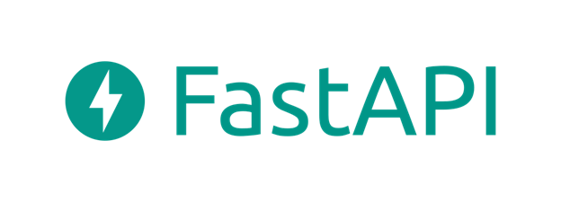

+++
title = 'Table of Content'
date = 2023-11-06T21:33:08+01:00
weight = 2
draft = true
+++

## TABLE OF CONTENT
1.	[Introduction to FastAPI](/chapter1/)

		a.	Modern Python with AsyncIO (add further reading on generators, coroutine, concurrency. Add video links to these topics)
		b.	JSON and API data
		c.	Type hints
		d.	Framework Structure
2.	[The mWallet P2P System](/chapter2/) 

		a.	Primer on blockchain
		b.	Blockchain explorer
		c.	How the system works
		d.	The mWallet application file structure
3.	[Identifying Routes](/chapter3/) 

		a.	RESTful API Design (add further reading on REST design here)
		b.	Classical way of defining routes in FastAPI
		c.	Using YAML file for defining routes
4.	[Application services](/chapter4/) 

		a.	Query
		b.	Path
		c.	Body
5.	[The Business domain entities and Database layer](/chapter5/)

		a.	Defining and Generating schemas (add tips on make_data, make_schema)
		b.	SQLAlchemy and database management (Add further reading for PyMongo, SQLAlchemy, SQLModel)
		c.	Eloquent SQLAlchemy queries
		d.	Database transactions (Add tips on delegated_task, generator for session, thread runners)
6.	[Middleware in FastAPI](/chapter6/)

		a.	Standard middleware – CORS, Gzip, etc.
		b.	Custom middleware 
7.	[Authorization and Authentication](/chapter7/)

		a.	Authentication (add further reading on JWT, OAuth, HTTP and Key access)
		b.	Permission based on scopes
		c.	API Permission class
8.	[Testing](/chapter8/)

		a.	Pytest
		b.	Doctest
		c.	Hypothesis
9.	[Resources](/chapter9/)

		a.	APPENDIX 1: Some technical considerations with FastAPI
			i. Python Async framework (consider uv-loop, async web servers)
			ii. Managing Errors and Exception - Logs and more
			iii. Deployment of FastAPI on RailApp or AWS servers
		b.	APPENDIX 2: SOME GENERAL TIPS ON WEB DEVELOPMENT 
				i. Designing for constraints
				ii. Evolutionary design
				iii. Interviewing clients for web project
				iv. Pricing web projects
				v. Managing changes and complexities in Web application development
		c.	APPENDIX 3: SOME GENERAL CONSIDERATION IN RUNNING ICT BUSINESS IN NIGERIA
				i. Building a Reputation and Brand
				ii. Developing relevant skills
				iii. Considering international partnerships
				iv. Improving productivity using development tools
				v. Reducing development cost by in house productivity tools
		d.	APPENDIX 4: 
				i. About the Author
				ii. About Codeskol
				iii. About A17S
				iv. About Bitmast Digital Services
				v. Any further inquiry?
